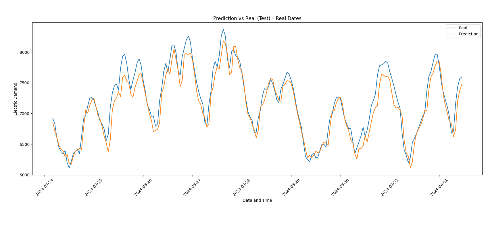
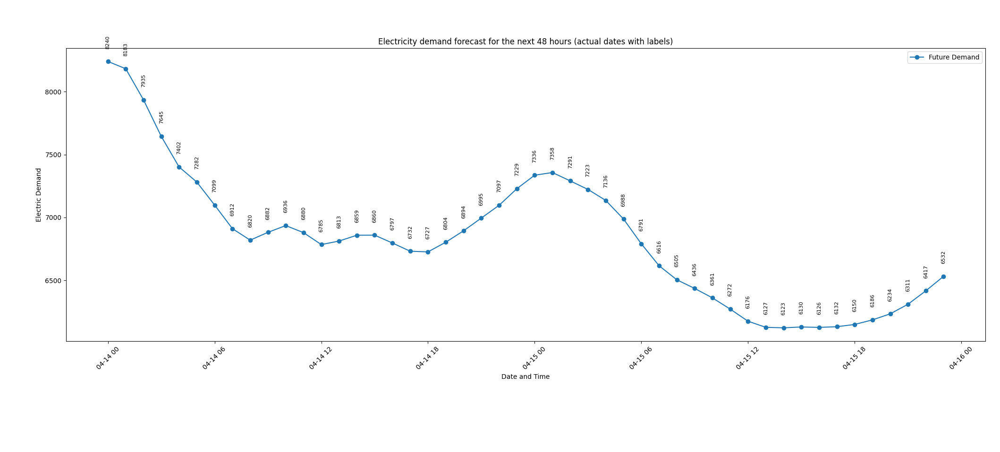

# Brazil Electricity Demand Forecast ⚡🤖

An end-to-end Machine Learning project delivering highly accurate hourly electricity demand forecasting for the **Norte (Northern) Subsystem** of Brazil's national interconnected power grid. Built with Python and Scikit-learn.

---

## 1. Project Overview & Business Impact

### Context & Background
The National Grid Operator in Brazil (ONS) manages a massively complex, interconnected electrical network. Within this system, the **Norte Subsystem** presents a unique challenge: its high geographic isolation, coupled with sudden load surges from heavy industrial activity, creates massive volatility. Traditional linear forecasting models fail to capture the non-linear, time-dependent human and industrial behaviors that dictate modern energy consumption.

### Importance & Strategic Value
* **Grid Reliability:** Accurate hourly forecasting prevents critical power blackouts by allowing proactive grid load balancing.
* **Financial Optimization:** Minimizes the activation of high-cost, high-emission thermoelectric backup plants.
* **Asset Maintenance:** Enables power grid operators to safely schedule tactical maintenance windows during predicted low-demand periods.

---

## 2. Methodology & Pipeline Workflow

The project implements a rigorous, structured engineering workflow to transform raw streaming data into a highly stable predictive asset:

1. **Data Ingestion:** Automated consumption of the authenticated historical feed from the ONS repository hosted on Hugging Face (`SamuelM0422/Hourly-Electricity-Demand-Brazil-Dataset`), pulling **46,320 original hourly records**.
2. **Target Isolation:** The dataset is filtered using the categorical label `nom_subsistema == 'NORTE'`, isolating `val_cargaenergiahomwmed` as our unique continuous target variable.
3. **Temporal Integrity:** Rows are explicitly converted into `datetime` timestamps and sorted chronologically. This is a critical step to ensure that no future sequences are mixed into past training structures.
4. **Data Splitting (Anti-Leakage Protocol):** The temporal sequence is partitioned into an **80% Training Set (37,036 samples)** and a **20% Testing Set (9,260 samples)** using a strict chronological cutoff point. This guarantees that the model evaluates its accuracy purely on unseen future data.

---

## 3. Advanced Technical Implementation

This section details the explicit mathematical and computational configurations applied within the Python pipeline:

### Data Feature Scaling
To protect the neural network from gradient saturation and speed up backpropagation convergence, the energy values (originally scaling into thousands of Megawatts) are normalized into a strict $[0, 1]$ boundary using `MinMaxScaler`:

$$x' = \frac{x - x_{\min}}{x_{\max} - x_{\min}}$$

### Time-Series Lag Engineering (Matrix Construction)
Instead of employing computationally heavy recurrent layers (RNN/LSTM), the pipeline restructures the univariate array into a supervised learning matrix using a sliding window approach with a **lookback horizon of 24 hourly steps ($T_{-1}$ to $T_{-24}$)**.
* **Immediate Inertia:** Rezagos $T_{-1}$ and $T_{-2}$ provide the core baseline continuity of the thermal grid load.
* **Circadian Recurrence Relevance:** Statistical correlation spikes heavily at $T_{-24}$, allowing the network to internalize fixed daily human patterns (e.g., peak afternoon hours vs. early morning drops).

### Neural Network Architecture (`MLPRegressor`)
The model utilizes a Deep Multi-Layer Perceptron architecture instantiated via Scikit-learn with the following hyperparameters:
* **Hidden Layer Topology:** `hidden_layer_sizes=(100, 50)` — A dense dual-layer structure designed to map highly non-linear temporal interactions.
* **Activation Function:** `activation='relu'` (Rectified Linear Unit) to prevent vanishing gradient problems.
* **Optimization Solver:** `solver='adam'` for stochastic gradient descent with adaptive step-sizes based on first and second moments.
* **Convergence Control:** `max_iter=500` coupled with automated **Early Stopping** to stop training the moment validation loss plateaus, effectively mitigating overfitting.

### Recursive Multi-Step Multi-Forecasting
To project a **48-hour future tactical horizon**, a recursive simulation loop was built. The network predicts the immediate next step ($T_{+1}$), and this output is appended back into the sliding window vector via an array shift (`np.roll`), dropping the oldest hour ($T_{-24}$) and inserting the new prediction at the end ($T_{-1}$) to recursively solve for $T_{+2}$ up to $T_{+48}$.

---

## 4. Experimental Results & Operational Interpretation

Diagnostic logs from the out-of-sample Testing Set yield outstanding reliability metrics:

* **0.0172 (1.72%) Normalized Error Standard Deviation:** This represents our baseline accuracy. A relative error under 2% is considered an elite benchmark in power systems engineering (where industry tolerance sits at < 5%).
* **182.13 MWmed RMSE (Root Mean Squared Error):** Because RMSE heavily penalizes large errors, this low score mathematically proves that the model successfully tracks high peak demands without extreme desynchronizations or flattening the curve.
* **136.24 MWmed Error Standard Deviation:** Confirms that the residual deviations are tightly clustered around zero. The absence of chaotic outliers or systemic drift ensures that operators can trust the model's reliability boundaries.

---

## 5. Visualizations & Projections

### Historical Test Performance (Actual vs. Predicted)
The chart below highlights the model's high fidelity in tracking the daily stochastics and peak demand behaviors across the test slice.


### 48-Hour Out-of-Sample Tactical Forecast
The recursive prediction loop outputs the following load structure for the upcoming 48 hours, showcasing stable convergence without numerical decay.


---

## 🚀 Quick Start & Usage

1. **Clone the repository:**
   ```bash
   git clone [https://github.com/yourusername/neural_networks_electricity_consumption.git](https://github.com/yourusername/neural_networks_electricity_consumption.git)
   ```

2. **Install required dependencies:**
```bash
pip install numpy pandas matplotlib scikit-learn datasets
```


3. **Execute the pipeline:**
```bash
python main.py
```


## 📂 Environment Tech Stack

* **Language Environment:** Python 3
* **Mathematical Operations:** NumPy, Pandas
* **Machine Learning Engine:** Scikit-learn (`MLPRegressor`, `MinMaxScaler`)
* **Visualization Framework:** Matplotlib
